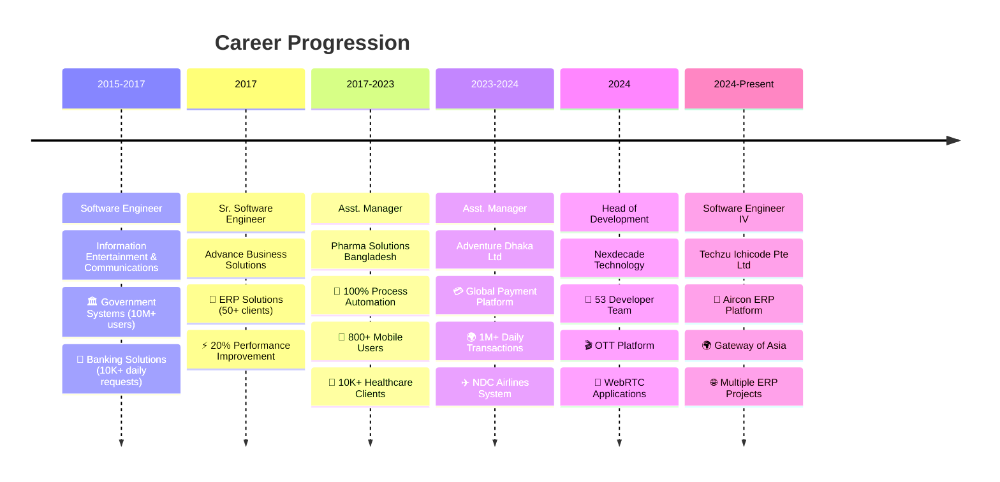
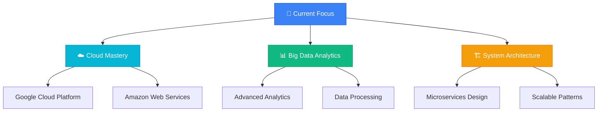
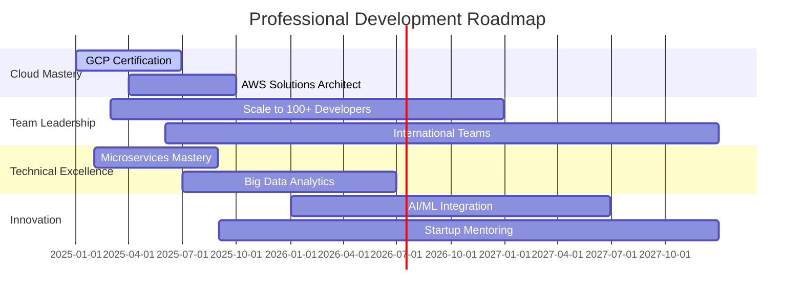

#  **Zawadul Kawum** - Senior Software Engineer & Technical Leader

<div align="center">

[](https://git.io/typing-svg)

</div>

<div align="center">
  
  
  
</div>

<br>

<div align="center">
  
</div>

---

## 🎯 **Professional Overview**

<table>
<tr>
<td width="55%">

### 🔧 **Senior Software Engineer** 
**10+ years** of experience building robust, scalable applications across **OTT**, **Global OTA**, **Healthcare**, **Financial Services**, and **Manufacturing** industries.

**🌟 Core Expertise:**
- 🏗️ **System Architecture** & **Microservices Design**
- ☁️ **Cloud Computing** (GCP, AWS) & **DevOps**
- 👨‍💼 **Technical Leadership** & **Team Management**  
- 📊 **Performance Optimization** & **24x7 Operations**

**🚀 Currently Learning:**
- 🌐 **Advanced Cloud Platforms** (GCP, AWS)
- 📊 **Big Data Analysis** & **Analytics**
- 🔧 **Latest Frontend/Backend Technologies**

</td>
<td width="45%">

<div align="center">

### 📊 **Impact Dashboard**


</div>

</td>
</tr>
</table>

---

## 🔥 **Achievement Highlights**

<div align="center">

[](https://github.com/zawad1992)
[](https://github.com/zawad1992)
[](https://github.com/zawad1992)
[](https://github.com/zawad1992)

</div>

---

## 💼 **Professional Journey Timeline**

<div align="center">



</div>

---

## 🏢 **Current Role: Software Engineer IV** 
### *Techzu Ichicode Pte Ltd.* `(Dec 2024 - Present)`

<div align="center">

[](https://github.com/zawad1992)
[](https://github.com/zawad1992)

</div>

**🎯 Current Mission:** Advanced software development and system architecture

<details>
<summary><strong>🔧 Responsibilities & Technologies</strong></summary>

**Core Responsibilities:**
- Advanced system architecture design
- Cross-platform solution development  
- Performance optimization and scaling
- Technical mentoring and knowledge sharing

**Technology Focus:**
- Modern development frameworks
- Cloud-native architectures
- Scalable system patterns
- International team collaboration

</details>

---

## 🎖️ **Head of Development** 
### *Nexdecade Technology* `(Mar 2024 - Dec 2024)`

<div align="center">

[](https://github.com/zawad1992)
[](https://github.com/zawad1992)

</div>

<details>
<summary><strong>🏆 Leadership Achievements & Technical Impact</strong></summary>

**👥 Leadership Excellence:**
- Led **53 developers** across multiple international projects
- Implemented agile methodologies and efficient sprint planning
- Conducted comprehensive requirement analysis and effort estimation
- Established mentoring programs with measurable team improvement

**🛠️ Technical Innovations:**
- 🎬 **OTT Platform Development** using Spring Boot architecture
- 📱 **WebRTC Calling Application** with Audio/Video/Group calling capabilities
- 🏢 **VMS & HRM Solutions** using Laravel, MySQL, SOAP and REST APIs
- 🔧 **API Performance Optimization** achieving 20% response time improvement

**📊 Key Results:**
- **+30%** scalability improvement via microservices
- **-20%** GCP cost reduction
- **-20%** API response time improvement
- **53** developers successfully managed

**🛠️ Technology Stack:**
```
Backend: Spring Boot, Laravel, MySQL, MongoDB
Communication: WebRTC, Socket.io, REST, SOAP
DevOps: Docker, Kubernetes, Redis, GCP
Architecture: Microservices, Event-driven, API Gateway
```

</details>

---

## 💳 **Asst. Manager, Payment Development** 
### *Adventure Dhaka Ltd.* `(Mar 2023 - Feb 2024)`

<div align="center">

[](https://github.com/zawad1992)
[](https://github.com/zawad1992)

</div>

<details>
<summary><strong>🌍 Global Payment Platform Architecture & Results</strong></summary>

**🏗️ System Design & Leadership:**
- **Designed entire payment ecosystem** handling **1M+ daily transactions**
- **Led development team** for global airline and hotel booking platform
- **Coordinated with overseas teams** managing cross-border collaboration
- **Defined sprint planning** based on international requirements

**🛠️ Technical Implementation:**
- 💳 **Global Payment Platform** integrating multiple worldwide gateways
- ✈️ **NDC Airlines Project** using Laravel, MySQL, and REST APIs
- 🔄 **Microservices migration** for enhanced scalability and performance
- 🌐 **Multi-country integration** across Philippines, Korea, Japan, and India

**📊 Impact Metrics:**
- **1M+** daily transactions processed
- **4** global markets integrated
- **99.9%** uptime SLA maintained
- **Microservices** architecture implemented

**🛠️ Technology Stack:**
```
Backend: Spring Boot, Laravel, MySQL
Processing: Apache Kafka, ELK Stack
Architecture: Microservices, Docker containers
Integration: Multiple Payment Gateways, NDC APIs
Monitoring: Real-time analytics, Performance tracking
```

</details>

---

## 🏥 **Asst. Manager, Application Development** 
### *Pharma Solutions Bangladesh* `(Nov 2017 - Feb 2023)`

<div align="center">

[](https://github.com/zawad1992)
[](https://github.com/zawad1992)

</div>

<details>
<summary><strong>🏥 Healthcare Technology Leadership & Automation</strong></summary>

**📱 Enterprise Application Portfolio:**
- 📲 **Order Management System** - Android, Laravel, C#, ASP.NET, SQL Server (**800+ field users**)
- 🏪 **Chemist Ordering Platform** - Android, Laravel, MySQL (**10,000+ clients**)
- 🏥 **Patient Management Portal** - CakePHP, MySQL with FEFO inventory logic (**5,000+ invoices**)
- 🌐 **Global Health Care Platform** - Laravel, VueJS, MySQL (**500+ clients**)

**🤖 Process Automation Systems:**
- 🔄 **Complete ERP automation** with 24/7 support for eZrx System
- 📦 **Promo Material Management** using Laravel and MySQL
- 🏭 **Damage/Expiry Management** across 17 branches (**10,000+ customers**)
- 🛡️ **Quality Management System** - CAPA, adverse events, incident management
- 🌡️ **Temperature Monitoring** - C#, Socket.io, Redis, Laravel, MongoDB
- 👥 **HRM System** - Complete HR automation (recruitment, leave, attendance, billing)

**📊 Automation Impact:**
- **100%** ERP order automation
- **50%** manual effort reduction
- **20+** branch locations covered
- **800+** mobile app users

**🛠️ Healthcare Tech Stack:**
```
Backend: Laravel, CakePHP, C#, ASP.NET
Frontend: VueJS, Android, Web Applications
Databases: MySQL, SQL Server, MongoDB, Redis
Integrations: ERP Systems, IoT Sensors, Real-time Monitoring
Automation: Order Processing, Inventory Management, HR Workflows
```

</details>

---

## 🎓 **Sr. Software Engineer** 
### *Advance Business Solutions* `(Mar 2017 - Oct 2017)`

<div align="center">

[](https://github.com/zawad1992)
[](https://github.com/zawad1992)

</div>

<details>
<summary><strong>🏢 ERP Solutions Development & Optimization</strong></summary>

**🏢 Business Solutions Development:**
- **Business & Education ERP** using CakePHP and MySQL
- **Requirement analysis** and tailored solution delivery for **50+ clients**
- **Performance optimization** achieving **10% faster project delivery**
- **Team mentoring** and cross-functional collaboration

**🏆 Key Achievements:**
- Enhanced system responsiveness across all client implementations
- **20% reduction in bug-related downtime** through proactive error handling
- Successful mentoring of junior developers with measurable skill improvement
- Improved operational efficiency for business and education sectors

</details>

---

## 💻 **Software Engineer** 
### *Information Entertainment & Communications* `(Feb 2015 - Feb 2017)`

<div align="center">

[](https://github.com/zawad1992)
[](https://github.com/zawad1992)

</div>

<details>
<summary><strong>🏛️ Government & Banking Systems Development</strong></summary>

**🏛️ Government Project Portfolio:**
- 🏛️ **PMIS for Ministry of Planning** - CakePHP, MySQL (project monitoring & inspections)
- 🏛️ **Bangladesh Parliament MIS** - Secure session records and document management
- 🏛️ **Government Retirement Portal** - Laravel, MySQL (**10,000+ retired personnel**)

**🏦 Banking & Financial Solutions:**
- 🏦 **Mobile Banking Backend API** - Spring Boot, MongoDB (**10M+ customers**)
- 📞 **Banking CRM System** - Laravel, MySQL (**10K+ daily service requests**)
- 💼 **Custom client applications** - CakePHP, CodeIgniter, Spring Boot, C# (**10+ clients**)

**📊 Large-Scale Impact:**
- **10M+** banking customers served
- **10K+** daily CRM service requests
- **10K+** government retirement personnel
- **10+** custom client systems

**🛠️ Government & Banking Tech:**
```
Backend: Spring Boot, Laravel, CakePHP, CodeIgniter
Databases: MongoDB, MySQL, Secure Storage
Architecture: REST APIs, Microservices, Secure Systems
Scale: 10M+ users, High availability, Government grade security
Domains: Government digitization, Banking solutions, Public services
```

</details>

---

## 🛠️ **Technical Expertise Matrix**

### 🖥️ **Backend Development Mastery**

<div align="center">

**🔥 Expert Level**


**⚡ Advanced**


**💪 Proficient**


</div>

### 🌐 **Frontend & Mobile Development**

<div align="center">

**🎨 Frontend Technologies**


**📱 Mobile Development**


</div>

### 🗄️ **Database & Storage Solutions**

<div align="center">


</div>

### ☁️ **DevOps & Cloud Technologies**

<div align="center">

**🐳 Containerization**


**☁️ Cloud Platforms**


**🔧 Development Tools**


</div>

### 💻 **Programming Languages Proficiency**

<div align="center">

**🏆 Master Level (10+ Years)**


**⚡ Expert Level (5+ Years)**


**💪 Proficient Level**


</div>

### 🔧 **Specialized Technologies**

<div align="center">

**📊 Data & Analytics**


**🎮 Creative Development**


</div>

---

## 📊 **GitHub Performance Analytics**

<div align="center">

### 🎯 **Development Statistics**


</div>

### 🏆 **Achievement Gallery**

<div align="center">


</div>

---

## 🚀 **Learning & Growth Roadmap**

### 📚 **2025 Learning Journey**

<div align="center">



</div>

### 🎓 **Professional Development Plan**

<div align="center">

**🌐 Cloud Computing**

[](https://cloud.google.com)
[](https://aws.amazon.com)

**📊 Data & Analytics**

[](https://github.com/zawad1992)
[](https://github.com/zawad1992)

**👥 Leadership**

[](https://github.com/zawad1992)
[](https://github.com/zawad1992)

</div>

---

## 🌐 **Professional Network & Collaboration**

### 🤝 **Let's Connect and Build Amazing Solutions Together!**

<div align="center">

[](mailto:zawad1992@gmail.com)

[](https://www.linkedin.com/in/zawad1992/)
[](https://github.com/zawad1992)
[](https://zawadulkawum.com/)
[](https://www.facebook.com/zawad1992)

</div>

### 💬 **Discussion Topics I'm Passionate About:**

<div align="center">

[](https://github.com/zawad1992)
[](https://github.com/zawad1992)
[](https://github.com/zawad1992)
[](https://github.com/zawad1992)
[](https://github.com/zawad1992)

</div>

---

## 💡 **Developer Philosophy & Personal Touch**

<div align="center">


</div>

### 👨‍💻 **About Me**

```typescript
class ZawadulKawum {
    constructor() {
        this.name = "Zawadul Kawum";
        this.location = "Dhaka, Bangladesh 🇧🇩";
        this.experienceYears = 10;
        this.currentRole = "Software Engineer IV";
        this.philosophy = "Building robust solutions through teamwork and innovation";
        
        this.coreValues = [
            "👥 Great software is built by great teams",
            "🔄 Continuous learning drives innovation", 
            "⚡ Automation enhances human productivity",
            "🎯 Quality and reliability are non-negotiable",
            "🌱 Knowledge sharing accelerates growth"
        ];
        
        this.currentFocus = [
            "🌐 Mastering cloud platforms (GCP, AWS)",
            "📊 Exploring big data analytics",
            "🏗️ Designing scalable architectures",
            "👥 Leading high-performing teams"
        ];
    }
    
    getDailyMotivation() {
        return "Every challenge is an opportunity to innovate! 🚀";
    }
    
    getLifeMotto() {
        return "Code with passion, lead with purpose, innovate with impact! 💡";
    }
}

const zawad = new ZawadulKawum();
console.log(zawad.getDailyMotivation());
```

---

## 📈 **Professional Metrics Dashboard**

<div align="center">

### 🎯 **Career Impact Overview**

| Metric | Value | Progress |
|--------|-------|----------|
| 👨‍💼 **Leadership Experience** | 10+ Years |  |
| 👥 **Team Members Managed** | 53 Developers |  |
| 🚀 **Projects Delivered** | 100+ Successfully |  |
| 🌍 **Users Impacted** | 10M+ Daily |  |
| 🏆 **Performance Improvement** | 30% Average |  |
| ⚡ **System Uptime** | 99.9% SLA |  |

</div>

---

## 🎨 **Fun Facts & Interests**

<div align="center">

### 🌟 **Beyond the Code**

<table>
<tr>
<td width="50%">

**🎮 Creative Side:**
- 🎯 Unity game development (hobby projects)
- 🎨 UI/UX design exploration
- 📱 Mobile app prototyping
- 🤖 IoT and hardware tinkering

</td>
<td width="50%">

**🌱 Learning Never Stops:**
- 📚 Reading tech blogs and documentation
- 🎥 Following industry conferences and talks
- 💡 Experimenting with new frameworks
- 🤝 Mentoring junior developers

</td>
</tr>
</table>

### 🏆 **Professional Accomplishments**

[](https://github.com/zawad1992)
[](https://github.com/zawad1992)
[](https://github.com/zawad1992)
[](https://github.com/zawad1992)

</div>

---

## 📊 **Skills Proficiency Chart**

<div align="center">

### 💪 **Technical Skills Breakdown**

| Technology Category | Proficiency | Years of Experience |
|---------------------|-------------|-------------------|
| **Backend Development** |  | 10+ years |
| **Frontend Development** |  | 8+ years |
| **Database Management** |  | 10+ years |
| **Cloud & DevOps** |  | 5+ years |
| **Mobile Development** |  | 6+ years |
| **Team Leadership** |  | 7+ years |
| **System Architecture** |  | 8+ years |
| **Project Management** |  | 7+ years |

</div>

---

## 🚀 **Future Goals & Vision**

<div align="center">

### 🎯 **2025-2027 Roadmap**



### 🌟 **Vision Statement**

> *"To become a technology leader who empowers teams to build innovative solutions that positively impact millions of users worldwide, while fostering a culture of continuous learning and excellence."*

</div>

---

## 🎉 **Recent Achievements & Recognition**

<div align="center">

### 🏆 **2024 Highlights**

| Achievement | Impact | Date |
|-------------|--------|------|
| 🎖️ **Led 53-member development team** | Successful delivery of multiple OTT & WebRTC projects | Mar 2024 |
| 🚀 **30% performance improvement** | Optimized system architecture for better scalability | Jun 2024 |
| 💰 **20% cost reduction** | Implemented efficient cloud solutions | Aug 2024 |
| 🌍 **Global team coordination** | Successfully managed international development teams | Ongoing |
| 📈 **1M+ daily transactions** | Built and maintained high-scale payment systems | 2023-2024 |

</div>

---

## 📞 **Let's Build Something Amazing Together!**

<div align="center">

### 🤝 **Open for Collaboration**

I'm always excited to discuss:
- 🏗️ **System Architecture** and scalable solutions
- 👥 **Team Leadership** and development best practices  
- ⚡ **Performance Optimization** strategies
- 🌐 **Cloud Migration** and DevOps automation
- 📊 **Big Data** and analytics implementation
- 🚀 **Startup** technical advisory and mentoring

### 📬 **Response Time**
- **Email**: Within 24 hours
- **LinkedIn**: Within 12 hours  
- **Emergency Projects**: Same day response

---

<div align="center">

### 💝 **Thank you for visiting my profile!**


</div>

</div>
