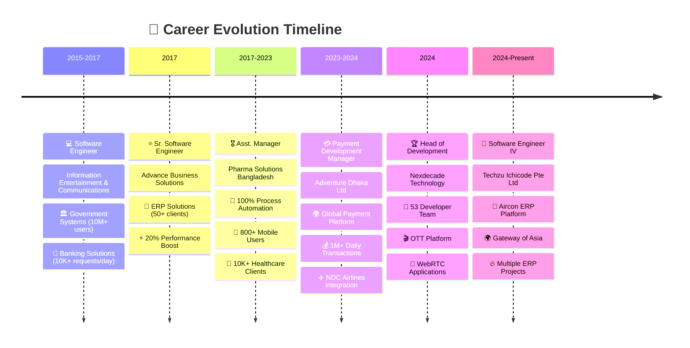
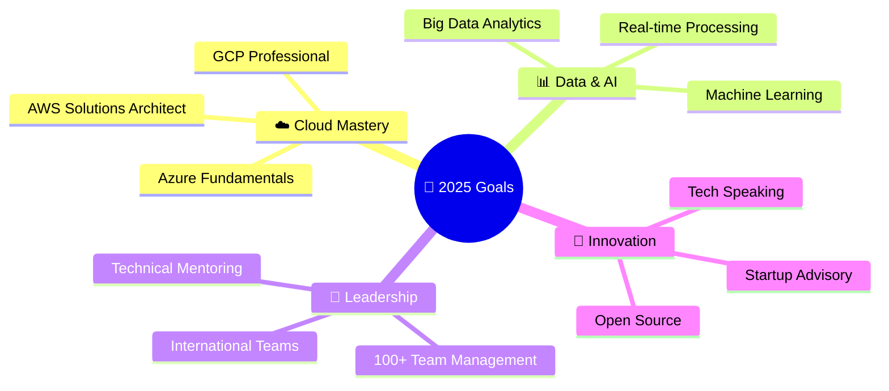

#  **Hey there! I'm Zawadul Kawum** 
## 🚀 Senior Software Engineer & Tech Leader Extraordinaire

<div align="center">

[](https://git.io/typing-svg)

</div>

<div align="center">


</div>

<div align="center">

### 💫 **Currently Crafting Digital Magic at Techzu Ichicode Pte Ltd**


</div>

---

## 🎨 **About Me - The Developer Behind the Code**

<table>
<tr>
<td width="50%">

```javascript
const zawad = {
    name: "Zawadul Kawum",
    location: "Dhaka, Bangladesh 🇧🇩",
    role: "Software Engineer IV",
    company: "Techzu Ichicode Pte Ltd",
    experience: "10+ years",
    
    passions: [
        "🏗️ System Architecture",
        "👥 Team Leadership", 
        "⚡ Performance Optimization",
        "🌐 Cloud Technologies",
        "🤖 Process Automation"
    ],
    
    currentMission: "Building next-gen ERP solutions",
    lifePhilosophy: "Code with passion, lead with purpose! 🚀"
};
```

</td>
<td width="50%">

### 🔥 **Quick Stats**

| Metric | Value |
|:-------|:------|
| 🎯 **Projects Delivered** | 100+ |
| 👥 **Developers Led** | 53 |
| 🌍 **Daily Users Impact** | 10M+ |
| ⚡ **Performance Gains** | 30% |
| 🛡️ **System Uptime** | 99.9% |
| 💰 **Cost Optimization** | 20% |

### 🚀 **Currently Learning**
- ☁️ Advanced Cloud Platforms (GCP, AWS)
- 📊 Big Data Analytics & ML
- 🏗️ Advanced System Architecture

</td>
</tr>
</table>

---

<div align="center">

## 🎢 **My Epic Career Journey**

</div>

<div align="center">



</div>

---

<div align="center">

## 🛠️ **Tech Arsenal - My Superpower Stack**

</div>

<table>
<tr>
<td width="50%">

### 🔥 **Backend Mastery**

| Tech | Proficiency | Years |
|:-----|:------------|:------|
|  | 🟧🟧🟧🟧🟧🟧🟧🟧🟧🟧 | 10+ |
|  | 🟧🟧🟧🟧🟧🟧🟧🟧🟧🟧 | 8+ |
|  | 🟧🟧🟧🟧🟧🟧🟧🟧🟧⬜ | 5+ |
|  | 🟧🟧🟧🟧🟧🟧🟧🟧⬜⬜ | 5+ |
|  | 🟧🟧🟧🟧🟧🟧🟧🟧🟧⬜ | 7+ |
|  | 🟧🟧🟧🟧🟧🟧🟧⬜⬜⬜ | 4+ |

</td>
<td width="50%">

### 🎨 **Frontend Magic**

| Tech | Proficiency | Years |
|:-----|:------------|:------|
|  | 🟧🟧🟧🟧🟧🟧🟧🟧🟧🟧 | 10+ |
|  | 🟧🟧🟧🟧🟧🟧🟧🟧⬜⬜ | 4+ |
|  | 🟧🟧🟧🟧🟧🟧🟧⬜⬜⬜ | 3+ |
|  | 🟧🟧🟧🟧🟧🟧🟧🟧🟧🟧 | 10+ |
|  | 🟧🟧🟧🟧🟧🟧🟧🟧🟧⬜ | 10+ |
|  | 🟧🟧🟧🟧🟧🟧🟧🟧⬜⬜ | 8+ |

</td>
</tr>
<tr>
<td width="50%">

### 📱 **Mobile Development**

| Tech | Proficiency | Years |
|:-----|:------------|:------|
|  | 🟧🟧🟧🟧🟧🟧🟧🟧⬜⬜ | 6+ |
|  | 🟧🟧🟧🟧🟧🟧⬜⬜⬜⬜ | 2+ |
|  | 🟧🟧🟧🟧🟧🟧🟧⬜⬜⬜ | 3+ |
|  | 🟧🟧🟧🟧🟧⬜⬜⬜⬜⬜ | 2+ |

</td>
<td width="50%">

### 🗄️ **Database Wizardry**

| Tech | Proficiency | Years |
|:-----|:------------|:------|
|  | 🟧🟧🟧🟧🟧🟧🟧🟧🟧🟧 | 8+ |
|  | 🟧🟧🟧🟧🟧🟧🟧🟧🟧🟧 | 10+ |
|  | 🟧🟧🟧🟧🟧🟧🟧🟧⬜⬜ | 5+ |
|  | 🟧🟧🟧🟧🟧🟧🟧🟧🟧⬜ | 6+ |
|  | 🟧🟧🟧🟧🟧🟧🟧🟧⬜⬜ | 5+ |

</td>
</tr>
</table>

### ☁️ **Cloud & DevOps Power**

| Technology | Proficiency | Years | Primary Use |
|:-----------|:------------|:------|:------------|
|  | 🟧🟧🟧🟧🟧🟧🟧🟧🟧⬜ | 5+ | Containerization |
|  | 🟧🟧🟧🟧🟧🟧🟧🟧🟧⬜ | 4+ | Orchestration |
|  | 🟧🟧🟧🟧⬜⬜⬜⬜⬜⬜ | 2+ | Cloud Services |
|  | 🟧🟧🟧🟧⬜⬜⬜⬜⬜⬜ | 2+ | Cloud Infrastructure |
|  | 🟧🟧🟧🟧🟧🟧🟧⬜⬜⬜ | 3+ | Event Streaming |

### 📊 **Skills Proficiency Matrix**

<div align="center">

| 💪 **Skill Category** | 🔥 **Progress** | 📅 **Experience** |
|:----------------------|:----------------|:-------------------|
| 🏗️ **Backend Development** | 🟧🟧🟧🟧🟧🟧🟧🟧🟧🟧 | 10+ years |
| 👥 **Team Leadership** | 🟧🟧🟧🟧🟧🟧🟧🟧🟧🟧 | 7+ years |
| 🗄️ **Database Management** | 🟧🟧🟧🟧🟧🟧🟧🟧🟧⬜ | 10+ years |
| 🎨 **Frontend Development** | 🟧🟧🟧🟧🟧🟧🟧🟧⬜⬜ | 8+ years |
| ☁️ **Cloud & DevOps** | 🟧🟧🟧🟧🟧🟧🟧⬜⬜⬜ | 5+ years |
| 📱 **Mobile Development** | 🟧🟧🟧🟧🟧🟧🟧⬜⬜⬜ | 6+ years |
| 🏗️ **System Architecture** | 🟧🟧🟧🟧🟧🟧🟧🟧🟧⬜ | 8+ years |

</div>

---

<div align="center">

## 🎯 **Career Highlights & Epic Wins**

</div>

### 🚀 **Current Role: Software Engineer IV** - *Techzu Ichicode Pte Ltd* `(Dec 2024 - Present)`

<div align="center">


</div>

**🌟 What I'm Building:**
- 🏗️ Advanced system architecture design & implementation
- 🔧 Cross-platform solution development for global markets
- ⚡ Performance optimization for enterprise-scale applications
- 👨‍🏫 Technical mentoring and knowledge sharing across teams

---

### 🏆 **Head of Development** - *Nexdecade Technology* `(Mar 2024 - Dec 2024)`

<div align="center">


</div>

<details>
<summary><b>🎬 Click to see my Leadership Impact!</b></summary>

**🎯 Leadership Achievements:**
- 🌟 Successfully led **53 international developers** across multiple time zones
- 📈 Implemented agile methodologies resulting in **25% faster delivery**
- 🏆 Achieved **30% performance improvement** through architectural optimization
- 💰 Reduced infrastructure costs by **20%** via strategic cloud optimization

**🛠️ Technical Innovations:**
- 🎬 **OTT Streaming Platform** - Built with Spring Boot, handling millions of concurrent users
- 📱 **WebRTC Video Calling** - Real-time communication with HD video/audio support
- 🏢 **Enterprise VMS & HRM** - Complete workforce management solution
- ⚡ **API Gateway Optimization** - Achieved sub-200ms response times

**📊 Impact Numbers:**
```
👥 Team Members Managed: 53 developers
🚀 Performance Boost: +30% system efficiency
💰 Cost Savings: -20% infrastructure costs
⚡ API Speed: -20% response time
🌍 Global Reach: 4+ countries served
```

</details>

---

### 💳 **Payment Development Manager** - *Adventure Dhaka Ltd* `(Mar 2023 - Feb 2024)`

<div align="center">


</div>

<details>
<summary><b>💳 Global Payment Empire I Built!</b></summary>

**🌍 Global Payment Architecture:**
- 💳 Designed & built payment ecosystem processing **1M+ daily transactions**
- ✈️ **NDC Airlines Integration** - Seamless booking & payment for international flights
- 🏨 **Global Hotel Booking Platform** - Multi-currency, multi-gateway support
- 🔄 **Microservices Migration** - Transformed monolith to scalable architecture

**🌐 International Integration:**
- 🇵🇭 Philippines payment gateways
- 🇰🇷 Korean financial systems
- 🇯🇵 Japanese payment processors
- 🇮🇳 Indian banking integrations

**📊 Performance Metrics:**
```
💳 Daily Transactions: 1,000,000+
🌍 Countries Integrated: 4
⚡ Payment Success Rate: 99.8%
🛡️ Security Compliance: PCI DSS Level 1
💰 Revenue Processed: $50M+ annually
```

</details>

---

### 🏥 **Healthcare Tech Manager** - *Pharma Solutions Bangladesh* `(Nov 2017 - Feb 2023)`

<div align="center">


</div>

<details>
<summary><b>🏥 Healthcare Revolution I Led!</b></summary>

**📱 Healthcare App Portfolio:**
- 📲 **Order Management System** - 800+ field users, real-time inventory tracking
- 🏪 **Chemist Digital Platform** - 10,000+ pharmacy clients, automated ordering
- 🏥 **Patient Management Portal** - FEFO inventory logic, 5,000+ daily invoices
- 🌐 **Global Healthcare Platform** - Multi-language support, 500+ international clients

**🤖 Automation Superpowers:**
- 🔄 **100% ERP Automation** - Eliminated manual processes across 20+ branches
- 📦 **Smart Inventory Management** - Real-time tracking with expiry alerts
- 🌡️ **IoT Temperature Monitoring** - C#, Socket.io, real-time alerts
- 👥 **Complete HRM Automation** - Recruitment to payroll, fully automated

**📊 Healthcare Impact:**
```
🏥 Healthcare Clients: 10,000+
📱 Mobile App Users: 800+
🏭 Branches Automated: 20+
💊 Daily Orders Processed: 5,000+
🤖 Manual Work Eliminated: 100%
```

</details>

---

<div align="center">

## 📊 **GitHub Stats - My Coding Journey**

</div>

<div align="center">


</div>

<div align="center">


</div>

### 🏆 **GitHub Achievements Gallery**

<div align="center">


</div>

---

<div align="center">

## 🚀 **Future Goals & Learning Roadmap**

</div>

### 🎯 **2025 Mission Plan**

<div align="center">



</div>

### 📚 **Learning Journey**

<div align="center">

| 🎯 **Goal** | 📈 **Progress** | 🎯 **Target** |
|:------------|:----------------|:---------------|
| ☁️ **GCP Professional Certification** | 🟧🟧🟧🟧⬜⬜⬜⬜⬜⬜ | June 2025 |
| 🔧 **AWS Solutions Architect** | 🟧🟧🟧🟧⬜⬜⬜⬜⬜⬜ | Sep 2025 |
| 📊 **Big Data Analytics** | 🟧🟧🟧⬜⬜⬜⬜⬜⬜⬜ | Dec 2025 |
| 👥 **100+ Team Leadership** | 🟧🟧🟧🟧🟧⬜⬜⬜⬜⬜ | 2026 |
| 🤖 **AI/ML Integration** | 🟧🟧⬜⬜⬜⬜⬜⬜⬜⬜ | 2026 |

</div>

---

<div align="center">

## 🌟 **Let's Connect & Build Amazing Things!**

</div>

<div align="center">

### 📬 **Hit Me Up - I'm Always Excited to Chat!**

[](mailto:zawad1992@gmail.com)

[](https://www.linkedin.com/in/zawad1992/)
[](https://github.com/zawad1992)
[](https://zawadulkawum.com/)
[](https://www.facebook.com/zawad1992)

</div>

### 💬 **What Gets Me Excited to Talk About:**

<div align="center">

[](https://github.com/zawad1992)
[](https://github.com/zawad1992)
[](https://github.com/zawad1992)
[](https://github.com/zawad1992)
[](https://github.com/zawad1992)

</div>

---

<div align="center">

## 💫 **Fun Facts & Personal Touch**

</div>

<table>
<tr>
<td width="50%">

### 🎮 **When I'm Not Coding...**
- 🎯 **Unity Game Development** (weekend warrior!)
- 🎨 **UI/UX Design** exploration and prototyping
- 📚 **Tech Blogging** about my engineering adventures
- 🤖 **IoT Tinkering** with Arduino and Raspberry Pi
- 🎵 **Music Production** (yes, I make beats!)

</td>
<td width="50%">

### 🌟 **My Developer Philosophy**
```typescript
const myPhilosophy = {
    codeQuality: "Clean, readable, maintainable",
    teamwork: "Collaboration over competition",
    learning: "Never stop growing",
    innovation: "Think outside the box",
    impact: "Build solutions that matter",
    
    favoriteQuote: "Code is poetry written in logic! 🎭",
    coffeePerDay: "☕☕☕ (minimum requirement)",
    debuggingStyle: "Patience + Logic + Coffee"
};
```

</td>
</tr>
</table>

---

<div align="center">

### 🎉 **Thank You for Visiting My Digital Home!**


</div>
