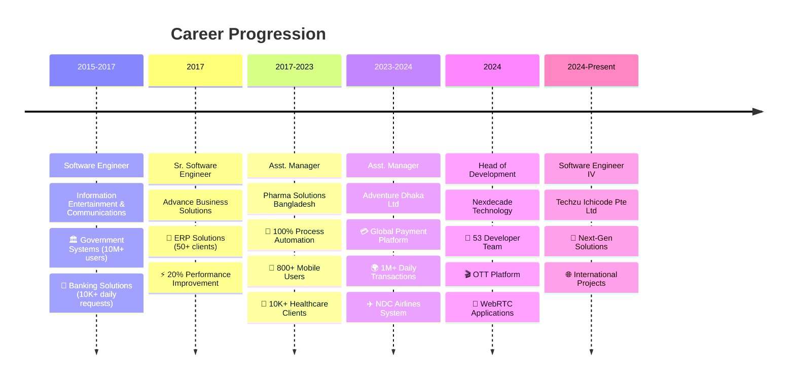
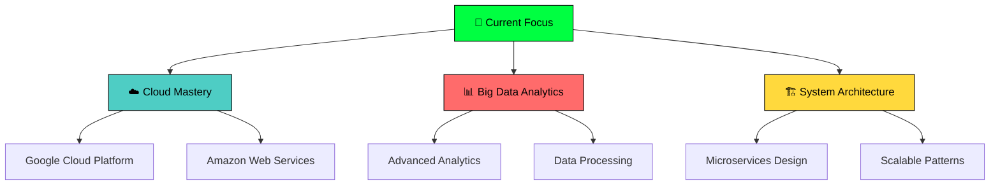

#  **Zawadul Kawum** - Senior Software Engineer & Technical Leader

<div align="left">

[](https://git.io/typing-svg)

</div>

```ascii
╔══════════════════════════════════════════════════════════════════════╗
║  🚀 SOFTWARE ENGINEER IV @ TECHZU ICHICODE PTE LTD                  ║
║  💻 10+ Years | 53 Team Members | 1M+ Daily Transactions            ║
║  🌐 Full-Stack • DevOps • Cloud • Technical Leadership              ║
╚══════════════════════════════════════════════════════════════════════╝
```

<div align="left">

</div>

---

## 🎯 **Professional Overview**

<table>
<tr>
<td width="60%">

**🔧 Senior Software Engineer** with **10+ years** of experience building robust, scalable applications across **OTT**, **Global OTA**, **Healthcare**, **Financial Services**, and **Manufacturing** industries. 

**Expertise in:**
- 🏗️ **System Architecture** & **Microservices Design**
- ☁️ **Cloud Computing** (GCP, AWS) & **DevOps**
- 👨‍💼 **Technical Leadership** & **Team Management**
- 📊 **Performance Optimization** & **24x7 Operations**

**Currently Learning:**
- 🌐 **Advanced Cloud Platforms** (GCP, AWS)
- 📊 **Big Data Analysis** & **Analytics**
- 🔧 **Latest Frontend/Backend Technologies**

</td>
<td width="40%">

```bash
┌─ IMPACT DASHBOARD ─────────┐
│                            │
│  👥 TEAM LEADERSHIP        │
│  ▓▓▓▓▓▓▓▓▓▓ 53 Developers  │
│                            │
│  📈 PERFORMANCE            │
│  ▓▓▓▓▓▓▓▓▓▓ 30% Improved   │
│                            │
│  🌐 SCALE                  │
│  ▓▓▓▓▓▓▓▓▓▓ 1M+ Trans/Day  │
│                            │
│  ⚡ UPTIME                 │
│  ▓▓▓▓▓▓▓▓▓▓ 99.9% SLA      │
│                            │
└────────────────────────────┘
```

</td>
</tr>
</table>

<div align="left">

### 🔥 **Achievement Highlights**

[](https://github.com/zawad1992)
[](https://github.com/zawad1992)
[](https://github.com/zawad1992)
[](https://github.com/zawad1992)

</div>

---

## 💼 **Professional Journey Timeline**

<div align="left">



</div>

### 🏢 **Current Role: Software Engineer IV** - *Techzu Ichicode Pte Ltd.* `(Dec 2024 - Present)`

<div align="left">

[](https://github.com/zawad1992)
[](https://github.com/zawad1992)

</div>

**🎯 Current Mission:** Advanced software development and system architecture

<details>
<summary><strong>🔧 Responsibilities & Technologies</strong></summary>

```yaml
Core Responsibilities:
  - Advanced system architecture design
  - Cross-platform solution development  
  - Performance optimization and scaling
  - Technical mentoring and knowledge sharing

Technology Focus:
  - Modern development frameworks
  - Cloud-native architectures
  - Scalable system patterns
  - International team collaboration
```

</details>

### 🎖️ **Head of Development** - *Nexdecade Technology* `(Mar 2024 - Dec 2024)`

<div align="left">

[](https://github.com/zawad1992)
[](https://github.com/zawad1992)

</div>

<details>
<summary><strong>🏆 Leadership Achievements & Technical Impact</strong></summary>

**👥 Leadership Excellence:**
- Led **53 developers** across multiple international projects
- Implemented agile methodologies and efficient sprint planning
- Conducted comprehensive requirement analysis and effort estimation
- Established mentoring programs with measurable team improvement

**🛠️ Technical Innovations:**
- 🎬 **OTT Platform Development** using Spring Boot architecture
- 📱 **WebRTC Calling Application** with Audio/Video/Group calling capabilities
- 🏢 **VMS & HRM Solutions** using Laravel, MySQL, SOAP and REST APIs
- 🔧 **API Performance Optimization** achieving 20% response time improvement

**📊 Quantified Results:**
```bash
┌─ PERFORMANCE METRICS ──────────────────────┐
│                                            │
│  Scalability:  ▓▓▓▓▓▓▓▓▓▓ +30% via μServices │
│  Cost Saving:  ▓▓▓▓▓▓▓▓▓▓ -20% GCP costs    │
│  API Speed:    ▓▓▓▓▓▓▓▓▓▓ -20% response time │
│  Team Growth:  ▓▓▓▓▓▓▓▓▓▓ 53 devs managed   │
│                                            │
└────────────────────────────────────────────┘
```

**🛠️ Technology Stack:**
```typescript
const techStack = {
  backend: ["Spring Boot", "Laravel", "MySQL", "MongoDB"],
  communication: ["WebRTC", "Socket.io", "REST", "SOAP"],
  devops: ["Docker", "Kubernetes", "Redis", "GCP"],
  architecture: ["Microservices", "Event-driven", "API Gateway"]
};
```

</details>

---

## 🛠️ **Technical Expertise Matrix**

<div align="left">

### 🖥️ **Backend Development Mastery**

<table>
<tr>
<td><strong>🔥 Expert Level</strong></td>
<td><strong>⚡ Advanced</strong></td>
<td><strong>💪 Proficient</strong></td>
</tr>
<tr>
<td>


</td>
<td>


</td>
<td>


</td>
</tr>
</table>

### 🌐 **Frontend & Mobile Development**

<table>
<tr>
<td><strong>🎨 Frontend Technologies</strong></td>
<td><strong>📱 Mobile Development</strong></td>
</tr>
<tr>
<td>

**Core Technologies:**


**Frameworks & Libraries:**


</td>
<td>

**Mobile Platforms:**


**Development Tools:**


</td>
</tr>
</table>

### 🗄️ **Database & Storage Solutions**

<div align="left">

```bash
┌─ DATABASE EXPERTISE ─────────────────────────────────────────┐
│                                                              │
│  🔥 EXPERT LEVEL:                                            │
│  █ MongoDB      ████████████████████████████████████ 95%    │
│  █ MySQL        ███████████████████████████████ 85%         │
│  █ Redis        ████████████████████████████████████ 95%    │
│                                                              │
│  ⚡ ADVANCED LEVEL:                                          │
│  █ PostgreSQL   ████████████████████████ 75%                │
│  █ SQL Server   ████████████████████████ 75%                │
│                                                              │
└──────────────────────────────────────────────────────────────┘
```

</div>


### ☁️ **DevOps & Cloud Technologies**

<table>
<tr>
<td><strong>🐳 Containerization</strong></td>
<td><strong>☁️ Cloud Platforms</strong></td>
<td><strong>🔧 Development Tools</strong></td>
</tr>
<tr>
<td>


**Skill Level:**
```
Docker:     ████████████████████ 95%
Kubernetes: ████████████████████ 95%
```

</td>
<td>


**Learning Progress:**
```
GCP:  ████████ 40% (Learning)
AWS:  ████████ 40% (Learning)
```

</td>
<td>


</td>
</tr>
</table>

### 💻 **Programming Languages Proficiency**

<div align="left">

```bash
┌─ PROGRAMMING MASTERY ────────────────────────────────────────┐
│                                                              │
│  🏆 MASTER LEVEL (10+ Years):                               │
│  █ C/C++        ██████████████████████████████████████ 100% │
│  █ C#           ██████████████████████████████████████ 100% │
│  █ PHP          ██████████████████████████████████████ 100% │
│  █ JavaScript   ██████████████████████████████████████ 100% │
│                                                              │
│  ⚡ EXPERT LEVEL (5+ Years):                                │
│  █ Java         ████████████████████████████████ 85%        │
│                                                              │
│  💪 PROFICIENT LEVEL:                                       │
│  █ Python       ████████████████████ 65%                    │
│                                                              │
└──────────────────────────────────────────────────────────────┘
```

</div>


### 🔧 **Specialized Technologies**

<table>
<tr>
<td><strong>📊 Data & Analytics</strong></td>
<td><strong>🎮 Creative Development</strong></td>
</tr>
<tr>
<td>


**Current Focus:**
- Advanced Big Data Analysis
- Performance Analytics
- System Monitoring
- Data Processing Pipelines

</td>
<td>


**Creative Projects:**
- Game Development (Hobby)
- Interactive Applications
- 3D Visualization
- Creative Problem Solving

</td>
</tr>
</table>

</div>

---

## 📊 **GitHub Performance Analytics**

<div align="left">

### 🎯 **Development Statistics**

<table>
<tr>
<td>

**📈 Performance Overview**


</td>
<td>

**🔥 Activity Streak**


</td>
</tr>
<tr>
<td colspan="2">

**💻 Language Distribution**


</td>
</tr>
</table>

### 🏆 **Achievement Gallery**

<div align="left">


</div>

### 📊 **Professional Metrics Dashboard**

```bash
┌─ 📈 CAREER STATISTICS ───────────────────────────────────────┐
│                                                              │
│  👨‍💼 LEADERSHIP EXPERIENCE                                    │
│  ▓▓▓▓▓▓▓▓▓▓▓▓▓▓▓▓▓▓▓▓▓▓▓▓▓▓▓▓▓▓▓▓▓▓▓▓▓▓▓▓ 7+ Years           │
│                                                              │
│  👥 TEAM MEMBERS MANAGED                                     │
│  ▓▓▓▓▓▓▓▓▓▓▓▓▓▓▓▓▓▓▓▓▓▓▓▓▓▓▓▓▓▓▓▓▓▓▓▓▓▓▓▓ 53 Developers       │
│                                                              │
│  🚀 PROJECTS DELIVERED                                       │
│  ▓▓▓▓▓▓▓▓▓▓▓▓▓▓▓▓▓▓▓▓▓▓▓▓▓▓▓▓▓▓▓▓▓▓▓▓▓▓▓▓ 100+ Successfully   │
│                                                              │
│  🌍 USERS IMPACTED                                           │
│  ▓▓▓▓▓▓▓▓▓▓▓▓▓▓▓▓▓▓▓▓▓▓▓▓▓▓▓▓▓▓▓▓▓▓▓▓▓▓▓▓ 10M+ Daily         │
│                                                              │
└──────────────────────────────────────────────────────────────┘
```

</div>

---

## 🚀 **Learning & Growth Roadmap**

<div align="left">

### 📚 **2025 Learning Journey**



### 🎓 **Professional Development Plan**

<table>
<tr>
<td><strong>🌐 Cloud Computing</strong></td>
<td><strong>📊 Data & Analytics</strong></td>
<td><strong>👥 Leadership</strong></td>
</tr>
<tr>
<td>

[](https://cloud.google.com)
[](https://aws.amazon.com)

**Progress:**
```
GCP Certification: ████████ 40%
AWS Solutions:     ████████ 40%
Cloud Native:      ████████████ 60%
```

</td>
<td>

[](https://github.com/zawad1992)
[](https://github.com/zawad1992)

**Learning Areas:**
- Advanced Analytics Frameworks
- Real-time Data Processing
- Performance Monitoring
- Predictive Analytics

</td>
<td>

[](https://github.com/zawad1992)
[](https://github.com/zawad1992)

**Growth Goals:**
- Scale to 100+ team members
- Advanced project management
- Technical mentoring programs
- International team leadership

</td>
</tr>
</table>

</div>

---

## 🌐 **Professional Network & Collaboration**

<div align="left">

### 🤝 **Let's Connect and Build Amazing Solutions Together!**

<table>
<tr>
<td><strong>📧 Direct Contact</strong></td>
<td><strong>🌐 Social Platforms</strong></td>
<td><strong>💼 Professional</strong></td>
</tr>
<tr>
<td>

[](mailto:zawad1992@gmail.com)

**zawad1992@gmail.com**

*Response time: 24 hours*

</td>
<td>

[](https://www.linkedin.com/in/zawad1992/)
[](https://www.facebook.com/zawad1992)

*Professional networking & updates*

</td>
<td>

[](https://github.com/zawad1992)
[](https://github.com/zawad1992)

*Code repositories & projects*

</td>
</tr>
</table>

### 💬 **Discussion Topics I'm Passionate About:**

[](https://github.com/zawad1992)
[](https://github.com/zawad1992)
[](https://github.com/zawad1992)
[](https://github.com/zawad1992)
[](https://github.com/zawad1992)

</div>

---

## 💡 **Developer Philosophy & Personal Touch**

<div align="left">


</div>

```python
class ZawadulKawum:
    def __init__(self):
        self.name = "Zawadul Kawum"
        self.location = "Dhaka, Bangladesh 🇧🇩"
        self.experience_years = 10
        self.philosophy = "Building robust solutions through teamwork and innovation"
        
        self.core_values = [
            "👥 Great software is built by great teams",
            "🔄 Continuous learning drives innovation", 
            "⚡ Automation enhances human productivity",
            "🎯 Quality and reliability are non-negotiable",
            "
