#  **Hey there! I'm Zawadul Kawum** 
## 🚀 Senior Software Engineer & Tech Leader Extraordinaire

<div align="center">

[](https://git.io/typing-svg)

</div>

<div align="center">


</div>

<div align="center">

### 💫 **Currently Crafting Digital Magic at Techzu Ichicode Pte Ltd**


</div>

---

## 🎨 **About Me - The Developer Behind the Code**

<table>
<tr>
<td width="50%">

```javascript
const zawad = {
    name: "Zawadul Kawum",
    location: "Dhaka, Bangladesh 🇧🇩",
    role: "Software Engineer IV",
    company: "Techzu Ichicode Pte Ltd",
    experience: "10+ years",
    
    passions: [
        "🏗️ System Architecture",
        "👥 Team Leadership", 
        "⚡ Performance Optimization",
        "🌐 Cloud Technologies",
        "🤖 Process Automation"
    ],
    
    currentMission: "Building next-gen ERP solutions",
    lifePhilosophy: "Code with passion, lead with purpose! 🚀"
};
```

</td>
<td width="50%">

### 🔥 **Quick Stats**

| Metric | Value |
|:-------|:------|
| 🎯 **Projects Delivered** | 100+ |
| 👥 **Developers Led** | 53 |
| 🌍 **Daily Users Impact** | 10M+ |
| ⚡ **Performance Gains** | 30% |
| 🛡️ **System Uptime** | 99.9% |
| 💰 **Cost Optimization** | 20% |

### 🚀 **Currently Learning**
- ☁️ Advanced Cloud Platforms (GCP, AWS)
- 📊 Big Data Analytics & ML
- 🏗️ Advanced System Architecture

</td>
</tr>
</table>

---

<div align="center">

## 🎢 **My Epic Career Journey**

```mermaid
timeline
    title 🚀 Career Evolution Timeline
    
    2015-2017 : 💻 Software Engineer
              : Information Entertainment & Communications
              : 🏛️ Government Systems (10M+ users)
              : 🏦 Banking Solutions (10K+ requests/day)
    
    2017 : ⭐ Sr. Software Engineer
         : Advance Business Solutions
         : 🏢 ERP Solutions (50+ clients)
         : ⚡ 20% Performance Boost
    
    2017-2023 : 🎖️ Asst. Manager
              : Pharma Solutions Bangladesh
              : 🤖 100% Process Automation
              : 📱 800+ Mobile Users
              : 🏥 10K+ Healthcare Clients
    
    2023-2024 : 💳 Payment Development Manager
              : Adventure Dhaka Ltd
              : 🌍 Global Payment Platform
              : 💰 1M+ Daily Transactions
              : ✈️ NDC Airlines Integration
    
    2024 : 🏆 Head of Development
         : Nexdecade Technology
         : 👥 53 Developer Team
         : 🎬 OTT Platform
         : 📱 WebRTC Applications
    
    2024-Present : 🚀 Software Engineer IV
                 : Techzu Ichicode Pte Ltd
                 : 🌟 Aircon ERP Platform
                 : 🌍 Gateway of Asia
                 : 🔥 Multiple ERP Projects
```

</div>

<div align="center">



</div>

---

<div align="center">

## 🛠️ **Tech Arsenal - My Superpower Stack**

</div>

<div align="left">

### 🔥 **Tech Mastery**

<table>
<thead>
<tr>
<th>💻 Tech</th>
<th>🔥 Proficiency</th>
<th>⏱️ Years</th>
<th>💻 Tech</th>
<th>🔥 Proficiency</th>
<th>⏱️ Years</th>
</tr>
</thead>
<tbody>
<tr><th align="left" colspan="6">🔥 Backend Mastery</th></tr>
<tr>
<td></td>
<td>🟧🟧🟧🟧🟧</td>
<td>10+</td>
<td></td>
<td>🟧🟧🟧🟧🟧</td>
<td>8+</td>
</tr>
<tr>
<td></td>
<td>🟧🟧🟧🟧⬜</td>
<td>5+</td>
<td></td>
<td>🟧🟧🟧⬜⬜</td>
<td>5+</td>
</tr>
<tr>
<td></td>
<td>🟧🟧🟧🟧⬜</td>
<td>7+</td>
<td></td>
<td>🟧🟧🟧⬜⬜</td>
<td>4+</td>
</tr>
<tr><th align="left" colspan="6">🎨 Frontend Magic</th></tr>
<tr>
<td></td>
<td>🟧🟧🟧🟧🟧</td>
<td>10+</td>
<td></td>
<td>🟧🟧🟧⬜⬜</td>
<td>4+</td>
</tr>
<tr>
<td></td>
<td>🟧🟧🟧🟧⬜</td>
<td>3+</td>
<td></td>
<td>🟧🟧🟧🟧🟧</td>
<td>10+</td>
</tr>
<tr>
<td></td>
<td>🟧🟧🟧⬜⬜</td>
<td>10+</td>
<td></td>
<td>🟧🟧🟧🟧🟧</td>
<td>8+</td>
</tr>
<tr><th align="left" colspan="6">📱 Mobile Development</th></tr>
<tr>
<td></td>
<td>🟧🟧🟧⬜⬜</td>
<td>6+</td>
<td></td>
<td>🟧⬜⬜⬜⬜</td>
<td>2+</td>
</tr>
<tr>
<td></td>
<td>🟧🟧🟧⬜⬜</td>
<td>3+</td>
<td colspan="3"></td>
</tr>
<tr><th align="left" colspan="6">🗄️ Database Wizardry</th></tr>
<tr>
<td></td>
<td>🟧🟧🟧🟧🟧</td>
<td>8+</td>
<td></td>
<td>🟧🟧🟧🟧🟧</td>
<td>10+</td>
</tr>
<tr>
<td></td>
<td>🟧🟧🟧⬜⬜</td>
<td>5+</td>
<td></td>
<td>🟧🟧🟧🟧⬜</td>
<td>6+</td>
</tr>
<tr>
<td></td>
<td>🟧🟧🟧⬜⬜</td>
<td>5+</td>
<td colspan="3"></td>
</tr>
<tr><th align="left" colspan="6">☁️ Cloud & DevOps Power</th></tr>
<tr>
<td></td>
<td>🟧🟧🟧🟧⬜</td>
<td>5+</td>
<td></td>
<td>🟧🟧🟧🟧⬜</td>
<td>4+</td>
</tr>
<tr>
<td></td>
<td>🟧🟧⬜⬜⬜</td>
<td>2+</td>
<td></td>
<td>🟧⬜⬜⬜⬜</td>
<td>2+</td>
</tr>
<tr>
<td></td>
<td>🟧🟧🟧⬜⬜</td>
<td>3+</td>
<td colspan="3"></td>
</tr>
</tbody>
</table>

### 📊 **Skills Proficiency Matrix**

<table>
<thead>
<tr>
<th>💪 Skill Category</th>
<th>🔥 Progress</th>
<th>📅 Experience</th>
</tr>
</thead>
<tbody>
<tr>
<td><strong>🏗️ Backend Development</strong></td>
<td>🟧🟧🟧🟧🟧</td>
<td>10+ years</td>
</tr>
<tr>
<td><strong>👥 Team Leadership</strong></td>
<td>🟧🟧🟧🟧🟧</td>
<td>7+ years</td>
</tr>
<tr>
<td><strong>🗄️ Database Management</strong></td>
<td>🟧🟧🟧🟧⬜</td>
<td>10+ years</td>
</tr>
<tr>
<td><strong>🎨 Frontend Development</strong></td>
<td>🟧🟧🟧⬜⬜</td>
<td>8+ years</td>
</tr>
<tr>
<td><strong>☁️ Cloud & DevOps</strong></td>
<td>🟧🟧🟧⬜⬜</td>
<td>5+ years</td>
</tr>
<tr>
<td><strong>📱 Mobile Development</strong></td>
<td>🟧🟧🟧⬜⬜</td>
<td>6+ years</td>
</tr>
<tr>
<td><strong>🏗️ System Architecture</strong></td>
<td>🟧🟧🟧🟧⬜</td>
<td>8+ years</td>
</tr>
</tbody>
</table>
</div>

---

<div align="center">

## 🎯 **Career Highlights & Epic Wins**

</div>

### 🚀 **Current Role: Software Engineer IV** - *Techzu Ichicode Pte Ltd* `(Dec 2024 - Present)`

<div align="center">


</div>

**🌟 What I'm Building:**
- 🏗️ Advanced system architecture design & implementation
- 🔧 Cross-platform solution development for global markets
- ⚡ Performance optimization for enterprise-scale applications
- 👨‍🏫 Technical mentoring and knowledge sharing across teams

---

### 🏆 **Head of Development** - *Nexdecade Technology* `(Mar 2024 - Dec 2024)`

<div align="center">


</div>

<details>
<summary><b>🎬 Click to see my Leadership Impact!</b></summary>

**🎯 Leadership Achievements:**
- 🌟 Successfully led **53 developers** on different stack
- 📈 Implemented agile methodologies resulting in **25% faster delivery**
- 🏆 Achieved **30% performance improvement** through architectural optimization
- 💰 Reduced infrastructure costs by **20%** via strategic cloud optimization

**🛠️ Technical Innovations:**
- 🎬 **OTT Streaming Platform** - Lead on Toffee & T Sports Platform, Built with Spring Boot, handling millions of concurrent users
- 📱 **WebRTC Video Calling** - Real-time communication with HD video/audio support
- 🏢 **Enterprise VMS & HRM** - Complete workforce management solution
- ⚡ **API Gateway Optimization** - Achieved sub-200ms response times

**📊 Impact Numbers:**
```
👥 Team Members Managed: 53 developers
🚀 Performance Boost: +30% system efficiency
💰 Cost Savings: -20% infrastructure costs
⚡ API Speed: -20% response time
```

</details>

---

### 💳 **Payment Development Manager** - *Adventure Dhaka Ltd* `(Mar 2023 - Feb 2024)`

<div align="center">


</div>

<details>
<summary><b>💳 Global Payment Empire I Built!</b></summary>

**🌍 Global Payment Architecture:**
- 💳 Designed & built payment ecosystem processing **1M+ daily transactions**
- ✈️ **NDC Airlines Integration** - Seamless booking & payment for international flights
- 🏨 **Global Hotel Booking Platform** - Multi-currency, multi-gateway support
- 🔄 **Microservices Migration** - Transformed monolith to scalable architecture

**🌐 International Integration:**
- 🇵🇭 Philippines payment gateways
- 🇰🇷 Korean financial systems
- 🇯🇵 Japanese payment processors
- 🇮🇳 Indian banking integrations

**📊 Performance Metrics:**
```
💳 Daily Transactions: 1,000,000+
🌍 Countries Integrated: 4
⚡ Payment Success Rate: 99.8%
```

</details>

---

### 🏥 **Healthcare Tech Manager** - *Pharma Solutions Bangladesh* `(Nov 2017 - Feb 2023)`

<div align="center">


</div>

<details>
<summary><b>🏥 Healthcare Revolution I Led!</b></summary>

**📱 Healthcare App Portfolio:**
- 📲 **Order Management System** - 800+ field users, real-time inventory tracking
- 🏪 **Chemist Digital Platform** - 10,000+ pharmacy clients, automated ordering
- 🏥 **Patient Management Portal** - FEFO inventory logic, 5,000+ daily invoices
- 🌐 **Global Healthcare Platform** - Multi-language support, 500+ international clients

**🤖 Automation Superpowers:**
- 🔄 **100% ERP Automation** - Eliminated manual processes across 20+ branches
- 📦 **Smart Inventory Management** - Real-time tracking with expiry alerts
- 🌡️ **IoT Temperature Monitoring** - C#, Socket.io, real-time alerts
- 👥 **Complete HRM Automation** - Recruitment to payroll, fully automated

**📊 Healthcare Impact:**
```
🏥 Healthcare Clients: 10,000+
📱 Mobile App Users: 800+
🏭 Branches Automated: 20+
💊 Daily Orders Processed: 5,000+
🤖 Manual Work Eliminated: 100%
```

</details>

---

<div align="center">

## 📊 **GitHub Stats - My Coding Journey**

</div>

<div align="center">


</div>

<div align="center">


</div>

### 🏆 **GitHub Achievements Gallery**

<div align="center">


</div>

---

<div align="center">

## 🚀 **Future Goals & Learning Roadmap**

</div>

### 🎯 **2025 Mission Plan**

```mermaid
mindmap
  root((🎯 2025 Goals))
    ☁️ Cloud Mastery
      GCP Professional
      AWS Solutions Architect
      Azure Fundamentals
    📊 Data & AI
      Big Data Analytics
      Machine Learning
      Real-time Processing
    👥 Leadership
      100+ Team Management
      International Teams
      Technical Mentoring
    🚀 Innovation
      Startup Advisory
      Open Source
      Tech Speaking
```

<div align="center">



</div>

### 📚 **Learning Journey**

<div align="center">

| 🎯 **Goal** | 📈 **Progress** | 🎯 **Target** |
|:------------|:----------------|:---------------|
| ☁️ **GCP Professional Certification** | 🟧🟧🟧🟧⬜⬜⬜⬜⬜⬜ | June 2025 |
| 🔧 **AWS Solutions Architect** | 🟧🟧🟧🟧⬜⬜⬜⬜⬜⬜ | Sep 2025 |
| 📊 **Big Data Analytics** | 🟧🟧🟧⬜⬜⬜⬜⬜⬜⬜ | Dec 2025 |
| 👥 **100+ Team Leadership** | 🟧🟧🟧🟧🟧⬜⬜⬜⬜⬜ | 2026 |
| 🤖 **AI/ML Integration** | 🟧🟧⬜⬜⬜⬜⬜⬜⬜⬜ | 2026 |

</div>

---

<div align="center">

## 🌟 **Let's Connect & Build Amazing Things!**

</div>

<div align="center">

### 📬 **Hit Me Up - I'm Always Excited to Chat!**

[](mailto:zawad1992@gmail.com)

[](https://www.linkedin.com/in/zawad1992/)
[](https://github.com/zawad1992)
[](https://zawadulkawum.com/)
[](https://www.facebook.com/zawad1992)

</div>

### 💬 **What Gets Me Excited to Talk About:**

<div align="center">

[](https://github.com/zawad1992)
[](https://github.com/zawad1992)
[](https://github.com/zawad1992)
[](https://github.com/zawad1992)
[](https://github.com/zawad1992)

</div>

---

<div align="center">

## 💫 **Fun Facts & Personal Touch**

</div>

<table>
<tr>
<td width="50%">

### 🎮 **When I'm Not Coding...**
- 🎯 **Unity Game Development** (weekend warrior!)
- 🎨 **UI/UX Design** exploration and prototyping
- 📚 **Tech Blogging** about my engineering adventures
- 🤖 **IoT Tinkering** with Arduino and Raspberry Pi
- 🎵 **Music Production** (yes, I make beats!)

</td>
<td width="50%">

### 🌟 **My Developer Philosophy**
```typescript
const myPhilosophy = {
    codeQuality: "Clean, readable, maintainable",
    teamwork: "Collaboration over competition",
    learning: "Never stop growing",
    innovation: "Think outside the box",
    impact: "Build solutions that matter",
    
    favoriteQuote: "Code is poetry written in logic! 🎭",
    coffeePerDay: "☕☕☕ (minimum requirement)",
    debuggingStyle: "Patience + Logic + Coffee"
};
```

</td>
</tr>
</table>

---

<div align="center">

### 🎉 **Thank You for Visiting My Digital Home!**


</div>
